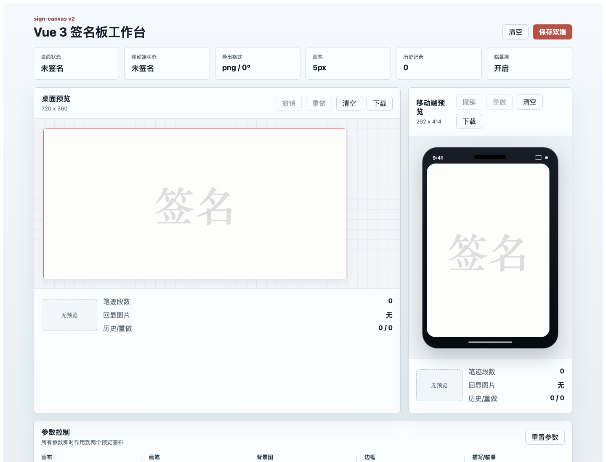
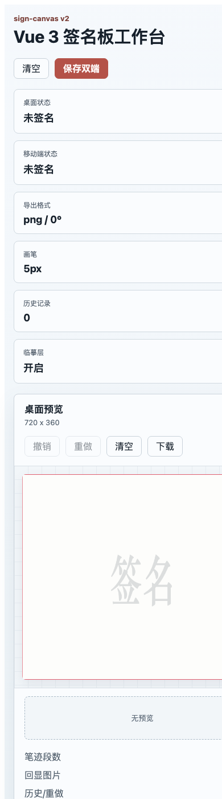
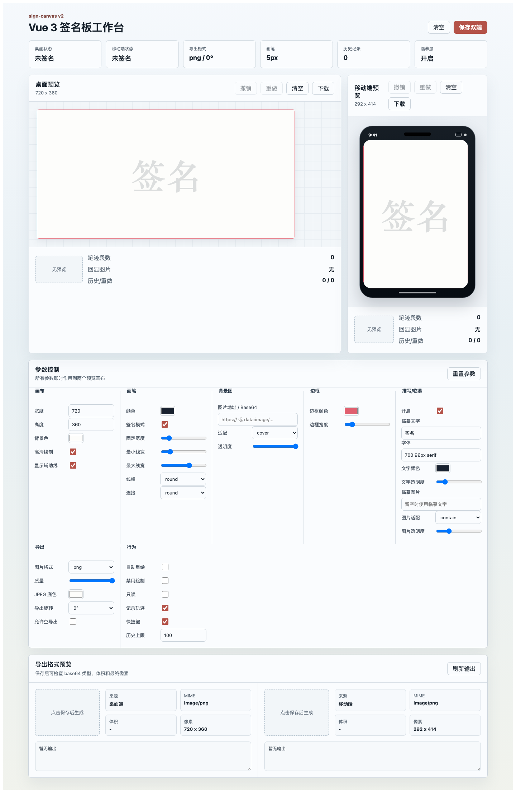

# sign-canvas

[简体中文](./README.md) | English

A Vue 3 + TypeScript signature canvas component for desktop and mobile web apps. It supports high-DPI rendering, empty-signature detection, image replay, readonly mode, undo/redo, tracing guides, background image composition, export rotation, JPEG background fill, and full TypeScript typings.

## Preview







## Version Notes

`2.0.0` is a full rewrite and is not compatible with Vue 2 or the old `1.x` build setup.

- New version: Vue 3 + TypeScript + Vite.
- Legacy version: Vue 2 + Vue CLI, available as `1.x`.
- If your project still uses Vue 2, install the legacy version:

```bash
npm i sign-canvas@1
```

You can also switch to the `1.x` branch for the old source code and documentation.

## Compatibility

`sign-canvas@2` targets Vue 3 Web/H5 environments and depends on browser DOM Canvas and Pointer Events.

The main package does not guarantee compatibility with uni-app mini-program, native App, or other non-standard DOM runtimes. If you only use uni-app H5, you may verify it in your own project. For mini-program or App targets, consider building a dedicated adapter instead of mixing platform-specific branches into this web package.

## Install

```bash
npm i sign-canvas
```

## Usage

```vue
<template>
  <SignCanvas
    ref="signCanvasRef"
    v-model="signature"
    :options="options"
    @change="status = $event"
  />
</template>

<script setup lang="ts">
import { ref } from 'vue';
import SignCanvas, {
  type SignCanvasExpose,
  type SignCanvasOptions,
  type SignatureStatus
} from 'sign-canvas';

const signature = ref<string | null>(null);
const signCanvasRef = ref<SignCanvasExpose | null>(null);
const status = ref<SignatureStatus>({
  empty: true,
  strokes: 0,
  hasImage: false,
  canUndo: false,
  canRedo: false,
  history: 0,
  redo: 0
});

const options: SignCanvasOptions = {
  canvasWidth: 600,
  canvasHeight: 360,
  isDpr: true,
  isSign: true,
  writeColor: '#101010',
  bgColor: '#fff',
  imgType: 'png'
};

function submit() {
  if (signCanvasRef.value?.isEmpty()) {
    return;
  }
  const image = signCanvasRef.value?.toDataURL();
}
</script>
```

## Global Registration

```ts
import { createApp } from 'vue';
import SignCanvas from 'sign-canvas';
import App from './App.vue';

createApp(App).use(SignCanvas).mount('#app');
```

## Options

| Option | Type | Default | Description |
|---|---|---:|---|
| `canvasWidth` | `number` | `600` | CSS width in non-fullscreen mode |
| `canvasHeight` | `number` | `600` | CSS height in non-fullscreen mode |
| `isFullScreen` | `boolean` | `false` | Use browser viewport size |
| `isFullCover` | `boolean` | `false` | Use fixed positioning in fullscreen mode |
| `isDpr` | `boolean` | `false` | Scale the real canvas by `devicePixelRatio` for sharper rendering |
| `isSign` | `boolean` | `false` | Signature mode uses fixed line width; disabled mode uses dynamic line width |
| `isShowBorder` | `boolean` | `true` | Draw border and helper guidelines |
| `bgColor` | `string` | `none` | Canvas/export background color; `none` means transparent |
| `backgroundImage` | `string` | `''` | Background image URL, base64, or CORS-enabled remote image |
| `backgroundImageFit` | `contain \| cover \| stretch \| center` | `cover` | Background image fitting mode |
| `backgroundImageOpacity` | `number` | `1` | Background image opacity, from `0` to `1` |
| `borderWidth` | `number` | `1` | Border and guideline width |
| `borderColor` | `string` | `#ff787f` | Border and guideline color |
| `writeWidth` | `number` | `5` | Fixed pen width in signature mode |
| `maxWriteWidth` | `number` | `30` | Maximum dynamic pen width |
| `minWriteWidth` | `number` | `5` | Minimum dynamic pen width |
| `writeColor` | `string` | `#101010` | Pen color |
| `lineCap` | `CanvasLineCap` | `round` | Line cap |
| `lineJoin` | `CanvasLineJoin` | `round` | Line join |
| `imgType` | `png \| jpeg \| jpg \| webp` | `png` | Export image type |
| `quality` | `number` | `1` | Export quality and scale ratio, from `0.1` to `1` |
| `jpegBgColor` | `string` | `#fff` | Fill color for transparent areas when exporting JPEG |
| `exportRotate` | `0 \| 90 \| 180 \| 270` | `0` | Rotation angle applied to exported images |
| `enableResize` | `boolean` | `true` | Redraw automatically on window resize |
| `disabled` | `boolean` | `false` | Disable drawing |
| `readonly` | `boolean` | `false` | Readonly display mode |
| `allowEmpty` | `boolean` | `false` | Allow exporting an empty canvas |
| `enableHistory` | `boolean` | `true` | Record stroke history for undo and redo |
| `enableShortcuts` | `boolean` | `true` | Enable `Ctrl+Z`, `Ctrl+Y`, and `Ctrl+Shift+Z` shortcuts |
| `maxHistory` | `number` | `100` | Maximum number of pen-down history entries |
| `guideEnabled` | `boolean` | `false` | Enable tracing/guide layer |
| `guideText` | `string` | `''` | Guide text |
| `guideFont` | `string` | `700 96px serif` | Guide text font, using Canvas font syntax |
| `guideTextColor` | `string` | `#101010` | Guide text color |
| `guideTextOpacity` | `number` | `0.16` | Guide text opacity, from `0` to `1` |
| `guideImage` | `string` | `''` | Guide image URL; takes priority over `guideText` |
| `guideImageFit` | `contain \| cover \| stretch \| center` | `contain` | Guide image fitting mode |
| `guideImageOpacity` | `number` | `0.24` | Guide image opacity, from `0` to `1` |

## Layers and Tracing

`backgroundImage` and the guide layer are auxiliary layers. They are visible on the canvas and are composed into exported images, but they do not count as real signature content. They are excluded from `isEmpty()`, stroke count, and undo/redo history.

```ts
const options: SignCanvasOptions = {
  canvasWidth: 720,
  canvasHeight: 360,
  bgColor: '#fff',
  backgroundImage: contractImageBase64,
  backgroundImageFit: 'cover',
  guideEnabled: true,
  guideText: 'John Doe',
  guideFont: '700 96px serif',
  guideTextColor: '#101010',
  guideTextOpacity: 0.16
};
```

To use an image as the tracing template, configure `guideImage`. It takes priority over `guideText`.

```ts
const options: SignCanvasOptions = {
  guideEnabled: true,
  guideImage: '/trace-template.png',
  guideImageFit: 'contain',
  guideImageOpacity: 0.22
};
```

## Export Rotation

`exportRotate` only affects the output image generated by `toDataURL()`, `saveAsImg()`, `downloadSignImg()`, and automatic `v-model` updates. It does not rotate the canvas displayed on the page.

```ts
const options: SignCanvasOptions = {
  imgType: 'jpeg',
  jpegBgColor: '#fff',
  exportRotate: 90
};
```

## Instance Methods

Call methods through a component ref:

```ts
signCanvasRef.value?.clear();
signCanvasRef.value?.toDataURL();
signCanvasRef.value?.fromDataURL(base64);
signCanvasRef.value?.undo();
signCanvasRef.value?.redo();
```

| Method | Return | Description |
|---|---|---|
| `clear(payload?)` | `void` | Clear the canvas |
| `canvasClear(payload?)` | `void` | Legacy alias of `clear` |
| `toDataURL(payload?)` | `string \| null` | Export the canvas; returns `null` for empty canvas by default |
| `saveAsImg(payload?)` | `string \| null` | Legacy alias of `toDataURL` |
| `downloadSignImg(name?)` | `string \| null` | Download the current signature image |
| `dealImage(quality?)` | `string \| null` | Legacy compressed export method |
| `fromDataURL(dataURL, payload?)` | `Promise<string \| null>` | Replay an existing signature image and continue drawing |
| `undo()` | `boolean` | Undo the latest pen-down action |
| `redo()` | `boolean` | Redo the latest undone pen-down action |
| `canUndo()` | `boolean` | Whether undo is available |
| `canRedo()` | `boolean` | Whether redo is available |
| `getStrokes()` | `SignStroke[]` | Get a snapshot of current stroke data |
| `isEmpty()` | `boolean` | Whether there is no real signature content |
| `getSignatureStatus()` | `SignatureStatus` | Return `{ empty, strokes, hasImage, canUndo, canRedo, history, redo }` |
| `redraw()` | `void` | Redraw manually |
| `initCanvas()` | `void` | Reinitialize canvas size manually |

## Undo and Redo

The component records history by pen-down actions instead of individual line segments. A continuous stroke is undone as one action.

- `Ctrl+Z` / `Command+Z`: undo
- `Ctrl+Y` / `Command+Y`: redo
- `Ctrl+Shift+Z` / `Command+Shift+Z`: redo

Keyboard shortcuts are ignored when the event target is an input, textarea, select, or contenteditable element. When multiple signature canvases exist on the same page, shortcuts only affect the focused canvas.

## Events

| Event | Payload | Description |
|---|---|---|
| `update:modelValue` | `string \| null` | Vue 3 `v-model` update |
| `confirm` | `string \| null` | Legacy-compatible event |
| `start` | `{ x, y }` | Drawing starts |
| `end` | `{ x, y }` | Drawing ends |
| `change` | `SignatureStatus` | Signature status changes |
| `clear` | none | Canvas is cleared |
| `undo` | `SignatureStatus` | Undo succeeds |
| `redo` | `SignatureStatus` | Redo succeeds |

## Local Development

```bash
npm install
npm run dev
npm run type-check
npm run lib
```

`npm run lib` outputs:

- `lib/sign-canvas.js`
- `lib/sign-canvas.umd.cjs`
- `lib/sign-canvas.css`
- `lib/types/**/*.d.ts`

## Demo

```text
https://langyuxiansheng.github.io/vue-sign-canvas/
```

## v2 Changes

- Full rewrite and breaking upgrade. Vue 2 projects should keep using `sign-canvas@1` or the `1.x` branch.
- Upgraded to Vue 3 + TypeScript + Vite.
- Uses Pointer Events for unified desktop and mobile input.
- Preserves existing strokes when `options` change.
- Adds `isEmpty()` and `getSignatureStatus()` for required-signature validation.
- Adds `fromDataURL()` for image replay and continued editing.
- Adds `readonly` and `disabled`.
- Adds stroke history, undo, redo, and keyboard shortcuts.
- Adds custom background image composition.
- Adds tracing/guide layer with text and image modes.
- Adds export rotation for `0 / 90 / 180 / 270` degrees.
- Fills JPEG transparent areas by default to avoid black backgrounds.
- Outputs `.d.ts` files for TypeScript projects.
